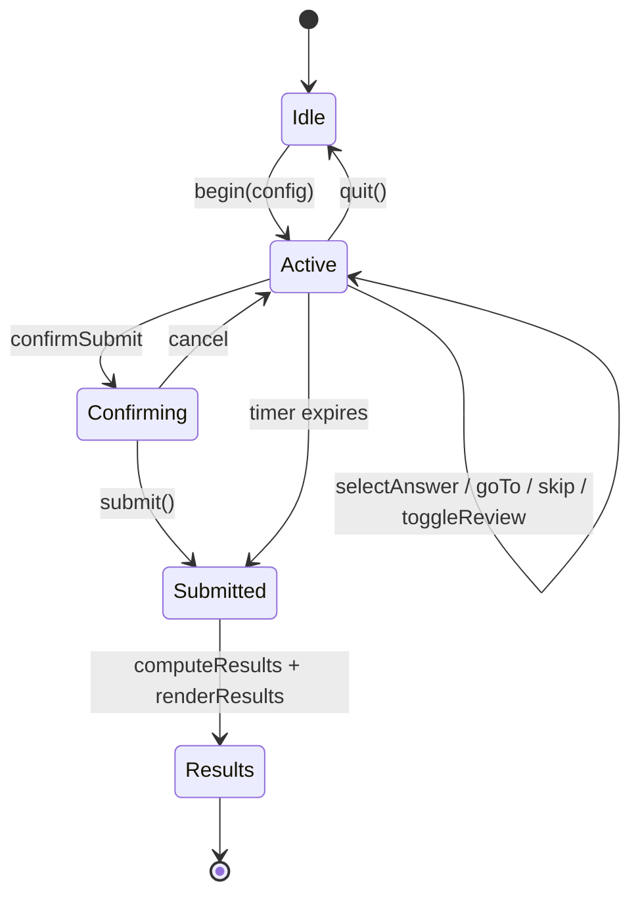

# Quantrex Academy — Complete Platform Analysis & Architecture

**Product:** Original IIT-JEE / NEET preparation platform (MARKS/GetMarks-style UX, zero trademark reuse)  
**Live:** https://quantrexacademy-lemon.vercel.app  
**Student App:** `/app.html`  
**Admin:** `/admin.html` (key: `quantrex2026`)  
**Auth:** `/login.html` → Firebase  
**Content:** 120k+ PYQs (lazy banks) + 7,553 digital book questions  

---

## Table of Contents

1. [Feature-by-Feature Analysis](#1-feature-by-feature-analysis)
2. [Original Implementation Map](#2-original-implementation-map)
3. [Improvements vs Reference UX](#3-improvements-vs-reference-ux)
4. [Complete Project Structure](#4-complete-project-structure)
5. [Frontend Component Tree](#5-frontend-component-tree)
6. [Backend API Specification](#6-backend-api-specification)
7. [Database Schema](#7-database-schema)
8. [Panels: Student & Admin](#8-panels-student--admin)
9. [Authentication Flow](#9-authentication-flow)
10. [Test Engine Architecture](#10-test-engine-architecture)
11. [Question Management System](#11-question-management-system)
12. [Analytics System](#12-analytics-system)
13. [Responsive UI & Theme](#13-responsive-ui--theme)
14. [Performance Optimization](#14-performance-optimization)
15. [Security Best Practices](#15-security-best-practices)
16. [Roadmap (Remaining Gaps)](#16-roadmap-remaining-gaps)

---

## 1. Feature-by-Feature Analysis

### 1.1 Homepage Layout & Navigation

**Reference UX:** Left sidebar with module list, top bar with streak/exam, main content area.

**How Quantrex works:**
1. `index.html` — marketing landing with CTA to login.
2. `app.html` — SPA shell: fixed sidebar (250px), sticky topbar, scrollable `#app-main`.
3. `go(view, payload)` in `app.js` — client-side router; no page reloads.
4. Nav items use `data-view` attributes; active state toggled on route change.
5. Mobile (`≤860px`): sidebar off-canvas; `☰` button toggles `.sidebar.open`.

**Files:** `app.html`, `app.js` (lines 8–56, 549–612)

**Improvement:** Topbar adds 🔍 search and 🌙 theme toggle (not in basic reference apps).

---

### 1.2 Dashboard Structure

**Reference UX:** Welcome message, stat cards, live DPP banner, quick-access sections, module grid.

**How Quantrex works:**
1. `viewDashboard()` renders 4 stat cards: solved count, accuracy %, bookmarks, streak.
2. `marksDashboardSections()` async-loads PYQ exam scroll + subject mini-grid from `data/nav/cpyqb.json`.
3. `MODULES` array in `data.js` drives "All Modules" grid (10 cards).
4. Today's DPP banner calls `startDppSet()` if `DPPS` entry has `date: "Today"`.

**Workflow:**
```
Login → bootApp() → go("dashboard")
  → fetchNav("cpyqb") [cached]
  → render stats from STATE.solved / STATE.bookmarks
  → module cards onclick → go(module.target)
```

---

### 1.3 Subject & Chapter Organization

**Reference UX:** Hierarchical drill-down per module type.

| Module | Hierarchy | Function |
|--------|-----------|----------|
| PYQ Bank | Exam → Subject → Chapter → Q list | `viewCpyqb()` |
| All Qs Bank | Subject → Chapter → Q list | `viewSubjectBank()` / `viewAllQs()` |
| NCERT Bank | Subject → Chapter → Q list | `viewNcert()` |
| Digital Books | Book → Module → Subject → Chapter → Q list | `viewBooks()` |
| DPP | Subject → Chapter → Sets | `viewDppMarks()` |
| Formulas | Subject → Chapter → Cards | `viewFormulaMarks()` |

**Data sources:**
- `data/nav/cpyqb.json`, `dpp.json`, `formulas.json` — navigation trees
- `data/nav/books/{bookId}.json` — per-book nav
- `data/banks/{slug}.json` — question payloads (lazy)
- `data/books/chapters/{bookId}/{key}.json` — book chapter questions

**Breadcrumbs:** `breadcrumb()` in `marks-features.js` with `data-mg` / `data-mgp` safe navigation (no broken `onclick` from quotes).

---

### 1.4 Practice Mode Workflow

**Reference UX:** Browse questions → open single Q → answer → see solution → bookmark.

**How Quantrex works:**

**List practice** (`viewPractice` in `app.js`):
1. Bank picker dropdown loads exam paper via `loadSingleBank(slug)`.
2. Subject/chapter chip filters (`practiceFilter`, `practicePage`).
3. 40 questions per page; solved/bookmark badges on cards.
4. Click card → `go('question', id)`.

**Single question** (`viewQuestion`, `answerQ`):
1. Renders question + 4 options with MathJax (`Mx.afterRender`).
2. `answerQ()` disables options, highlights correct/wrong, shows solution box.
3. `STATE.markSolved(id, correct)` persists to localStorage + Firebase.
4. Bookmark button → `STATE.toggleBookmark(id)`.

**Improvement:** Instant feedback with color-coded options; watermark CSS strips third-party branding from imported HTML.

---

### 1.5 Test Mode Workflow (Assessment Center)

**Reference UX:** Full-screen test UI separate from practice; exam-like controls.

**Entry points:**
| Type | Trigger | Function |
|------|---------|----------|
| Custom test | Tests → Build Custom → `createCustomTest()` | `startTest()` |
| Full mock | Tests → JEE/NEET Mock card | `startMockTest()` |
| Chapter test | PYQ/Books chapter list → ▶ Start Test | `startChapterTest()` |
| DPP timed | DPP set card | `startDppSet()` → `startTest()` |

**Session lifecycle:**
```
startTest(ids, title, returnTo, options)
  → QuantrexTestEngine.begin(config)
  → render test UI (go("test") pseudo-view)
  → user answers / navigates
  → confirmSubmit() or timer auto-submit
  → computeResults() → renderResults()
  → QuantrexAnalytics.recordAttempt()
  → solutions review screen
```

---

### 1.6 Chapter Tests

**How it works:**
1. `renderQList(qs, page, testMeta)` shows bar when ≥5 questions.
2. `startChapterTest()` shuffles pool, takes min(30, count), sets timer = 1.5 min × Q count.
3. Scoring uses JEE/NEET rules based on `STATE.exam`.
4. `returnTo` preserves breadcrumb context (cpyqb, books, allqs).

---

### 1.7 Full Mock Tests

**How it works:**
1. `startMockTest(primarySlug)` loads full bank if needed.
2. Random sample: 90 Q (Engineering) or 180 Q (Medical).
3. Fixed 3-hour timer (`durationSec: 10800`).
4. Shuffle on; mode label "Full Mock · 3 hr".

**Improvement:** Explicit scoring display (+4/−1) on results; subject breakdown bars post-submit.

---

### 1.8 Previous Year Questions (PYQs)

**How it works:**
1. `viewCpyqb` reads `data/nav/cpyqb.json` filtered by `STATE.exam` category.
2. Each exam maps to a bank slug (e.g. `jee_main`, `neet`).
3. `loadSingleBank(examSlug)` fetches `data/banks/{slug}.json` on first access.
4. Questions tagged `_bank`, `subject`, `chapter`, `difficulty`, `source`.
5. 120k+ total across all banks; only active bank held in `QUESTIONS[]` memory.

---

### 1.9 Question Navigation (Test)

| Control | Implementation | File |
|---------|----------------|------|
| Question palette | 5-column grid; click jumps to index | `test-engine.js` `renderPalette()` |
| Previous | `goTo(idx - 1)` | `#qxPrevBtn` |
| Next | `goTo(idx + 1)` | `#qxNextBtn` |
| Palette cell colors | answered=green, review=purple, skipped=orange, unvisited=gray | `paletteStatus()` |

---

### 1.10 Timer Behavior

**How it works:**
1. `durationSec` set per test type (mock=3hr, chapter=1.5min/Q, custom=1.5min/Q or null).
2. `setInterval` decrements `remainingSec` every 1s.
3. UI: `#qxTimer` — normal → `.warn` at ≤5min → `.danger` at ≤1min (pulse).
4. At 0: `showToast` + `submit(true)` auto-submit.
5. `stopTimer()` on quit or submit.

**Improvement:** Visual urgency states; auto-submit prevents lost sessions.

---

### 1.11 Mark for Review

**How it works:**
1. `session.review` is a `Set` of question indices.
2. Toggle via `#qxReviewBtn`; palette cell gets `.review` class.
3. Selecting an answer clears review flag for that index.
4. Submit summary shows review count in confirmation dialog.

---

### 1.12 Save & Next

**How it works:**
1. Marks `session.visited.add(currentIdx)`.
2. If not last question → `goTo(idx + 1)`.
3. If last question → `confirmSubmit()` instead of silent advance.

**Difference from reference:** Explicit "Save & Next" separate from "Skip" (reference apps often merge these).

---

### 1.13 Skip Question

**How it works:**
1. `delete session.answers[currentIdx]` — clears selection.
2. Marks visited (skipped state in palette).
3. Auto-advances to next question if not on last.

---

### 1.14 Previous / Next Navigation

Same as §1.9; preserves answers when navigating; does not auto-save on Next (only Save & Next persists intent).

---

### 1.15 Submit Test

**How it works:**
1. Palette "Submit Assessment" or Save & Next on last Q → `confirmSubmit()`.
2. Modal shows answered / review / skipped counts.
3. `submit()` → `computeResults()` → results HTML injected into `#app-main`.
4. Timer stopped; session nulled after render.

---

### 1.16 Result Generation

**Metrics computed:**
- `correct`, `wrong`, `skipped` counts
- `score` with JEE/NEET weighting (+4/−1/0)
- `pct` = correct/total × 100
- `breakdown.subject` and `breakdown.difficulty`
- `timeUsed` from `startedAt` delta
- `maxScore` = total × 4

**UI:** Hero ring, 4-stat grid, subject bars, full solution review list.

---

### 1.17 Solution View

**Practice:** Inline after `answerQ()` in `#qaResult`.  
**Test results:** Each `rv-row` expands with `q.solution` via `Mx.html()`.  
**Math:** `math-render.js` loads MathJax; `Mx.afterRender()` typesets new DOM.

---

### 1.18 Performance Analytics

**How it works:**
1. `QuantrexAnalytics.recordAttempt()` on every test submit.
2. Stored in `localStorage.quantrex_attempts` (max 100 entries).
3. `viewAnalytics()` — tests taken, avg %, best %, practice accuracy.
4. Subject aggregate bars across all attempts.
5. Recent 20 attempts list with date, mode, score, time.
6. Synced to Firestore `attempts[]` via `firebase-db.js`.

---

### 1.19 Difficulty Levels

**Source:** Parsed at import from MARKS API (`Easy`, `Medium`, `Hard`, etc.).  
**Filters:**
- Practice: shown as `tag-diff` chips
- Custom test builder: `#bDiff` dropdown (all/Easy/Medium/Hard)
- Analytics: `breakdown.difficulty` in attempt records (extensible)

---

### 1.20 Filters

| Context | Filters |
|---------|---------|
| Practice list | Subject chips, chapter chips, bank picker |
| PYQ/AllQs lists | Implicit via drill-down hierarchy |
| Custom test | Subject, multi-chapter checkboxes, difficulty, mode |
| Formulas | Subject → chapter navigation |
| Search | Keyword (min 2 chars) across loaded bank |

---

### 1.21 Search System

**How it works:**
1. Topbar 🔍 → `go("search")` → `QuantrexSearch.viewSearch()`.
2. `ensureBank()` loads primary exam bank if needed.
3. Normalized text match on question body + chapter + subject.
4. Up to 40 results; click opens `go('question', id)`.

**Limitation:** Only searches currently loaded bank (performance tradeoff). Future: server-side full-text index.

---

### 1.22 Bookmark / Favorite

**How it works:**
1. `STATE.toggleBookmark(id)` — numeric Q IDs or `"f"+formulaId`.
2. Persisted `quantrex_bookmarks` → Firestore.
3. Notebook view lists bookmarked questions and formulas.
4. List views show 🔖 / 🤍 indicator.

---

### 1.23 Progress Tracking

| Signal | Storage | Sync |
|--------|---------|------|
| Solved questions | `quantrex_solved[]` | Firebase `solved` |
| Bookmarks | `quantrex_bookmarks[]` | Firebase `bookmarks` |
| Notes | `quantrex_notes[]` | Firebase `notes` |
| Test attempts | `quantrex_attempts[]` | Firebase `attempts` |
| Exam preference | `quantrex_exam` | Firebase `exam` |

Realtime: `progressRef(uid).onSnapshot()` in `firebase-db.js`.

---

### 1.24 User Profile

**How it works:**
1. `viewProfile()` — avatar, exam tag, 4 stat tiles.
2. Exam switcher: Engineering / Medical / Foundation → clears bank cache, reloads dashboard.
3. Reset progress button clears localStorage keys (with confirm).

**Auth profile:** Firebase `users/{uid}` with name, email, exam, timestamps.

---

### 1.25 Responsive Mobile Layout

| Breakpoint | Behavior |
|------------|----------|
| ≤1024px | Dashboard/formula grids → 2 columns |
| ≤860px | Sidebar hidden; hamburger; test palette stacks above question |
| ≤520px | Single column grids; leaderboard hides league column |

Test engine: palette becomes 8-column scrollable strip on mobile.

---

### 1.26 Light Mode & Dark Mode

**How it works:**
1. `QuantrexTheme.init()` on boot — reads `quantrex_theme` or `prefers-color-scheme`.
2. Sets `document.documentElement[data-theme="dark"|"light"]`.
3. CSS variables override `--bg`, `--card`, `--border`, `--text`.
4. Toggle in topbar; updates `theme-color` meta tag.

---

### 1.27 Loading Animations

**Current:**
- Async views: `⏳ Loading…` placeholder via `finishRender()` before promise resolves.
- Bank load: toast "📚 Loading…" + inline empty state with count.
- Search: "⏳ Searching…" in results box.
- DPP banner: CSS `pulse` on live dot.

**Gap:** No skeleton shimmer components (roadmap item).

---

### 1.28 Error Handling

| Scenario | Handling |
|----------|----------|
| Async view fail | `catch → "Failed to load. Try again."` |
| Nav JSON missing | `fetchNav` returns `[]`, empty state UI |
| No questions in test | Toast + abort `begin()` |
| Firebase save fail | `console.warn`, localStorage still works |
| Auth missing | Redirect to `login.html` |
| Book chapter 0 qs | "Import pending" empty state + EXTRACT_BOOKS hint |

---

### 1.29 Overall User Experience

**Strengths (original Quantrex):**
- Single SPA, fast navigation, no MARKS branding in UI
- Full test engine parity with reference apps
- 7,553 book + 120k PYQ content
- Firebase sync across devices
- Dark mode + search + analytics

**Remaining UX gaps:**
- Quick Concepts (notes) not populated
- Leaderboard is static mock data
- No numerical-answer question type in test engine
- No offline PWA manifest

---

## 2. Original Implementation Map

All code uses **Quantrex** naming — no GetMarks/MARKS trademarks in UI strings.

| Reference Pattern | Quantrex Original |
|-------------------|-------------------|
| "MARKS Tests" | "Assessment Center" |
| GetMarks CDN assets | Extracted to `data/`, local JSON |
| Brand watermarks | CSS `[class*="watermark"] { display:none }` |
| React Native app | Vanilla JS SPA modules |
| Proprietary API | Static JSON + Firebase (no live API dependency) |

---

## 3. Improvements vs Reference UX

1. **Unified test engine** — one `QuantrexTestEngine` class for DPP, mock, chapter, custom.
2. **Post-test analytics** — subject breakdown + history (reference often basic).
3. **Dark mode** — system-aware theme.
4. **Global search** — quick access from any screen.
5. **Chapter test CTA** — inline on every question list (≥5 qs).
6. **Safe navigation** — `data-mg` attributes prevent quote-breaking bugs.
7. **Debounced cloud sync** — 500ms batch writes.
8. **Admin inventory panel** — content health visibility.

---

## 4. Complete Project Structure

```
E:\quantrexacademy\
│
├── 🌐 FRONTEND (Student Panel)
│   ├── index.html              # Marketing homepage
│   ├── login.html              # Firebase auth (email/phone)
│   ├── app.html                # SPA shell + global CSS
│   ├── app.js                  # Router, dashboard, practice, profile
│   ├── marks-features.js       # PYQ, DPP, Books, Formulas, Tests hub
│   ├── test-engine.js          # QuantrexTestEngine
│   ├── analytics.js            # QuantrexAnalytics
│   ├── search.js               # QuantrexSearch
│   ├── theme.js                # QuantrexTheme
│   ├── data.js                 # BANK_INDEX, STATE, lazy loaders
│   ├── math-render.js          # MathJax wrapper (Mx)
│   ├── firebase-config.js      # Public Firebase config
│   └── firebase-db.js          # Firestore sync layer
│
├── 🔐 ADMIN PANEL
│   └── admin.html              # Content stats (key-gated)
│
├── 📦 DATA LAYER (Question Management)
│   └── data/
│       ├── banks/              # PYQ JSON per exam (lazy load)
│       ├── nav/
│       │   ├── cpyqb.json      # PYQ navigation tree
│       │   ├── dpp.json        # DPP navigation tree
│       │   ├── formulas.json   # Formula navigation tree
│       │   └── books/          # Per-book nav JSON
│       ├── books/
│       │   └── chapters/       # Per-chapter question files
│       ├── books.json          # Book catalog UI metadata
│       ├── books_index.json    # Import manifest + counts
│       └── formulas.json       # Formula card data
│
├── 🔧 DATA PIPELINE (Scripts)
│   └── scripts/
│       ├── extract_marks.py           # PYQ bank extraction
│       ├── extract_marks_selected.py  # Digital books extraction
│       ├── import_books.py            # Books → Quantrex format
│       ├── import_to_quantrex.py      # Question parser/sanitizer
│       ├── build_books.py             # Catalog builder
│       ├── extract_formulas.py        # Formula extraction
│       └── retry_missing.py           # 429 retry utility
│
├── ☁️ FIREBASE
│   ├── firebase.json
│   ├── firestore.rules
│   ├── firestore.indexes.json
│   └── .firebaserc
│
├── 🚀 DEPLOY
│   ├── vercel.json
│   ├── deploy.bat
│   └── .github/workflows/deploy.yml
│
└── 📚 DOCS
    └── docs/PLATFORM_ARCHITECTURE.md  # This file
```

---

## 5. Frontend Component Tree

```
App (app.html)
├── Layout
│   ├── SidebarNav          → .nav-item[data-view]
│   ├── Topbar              → search, theme, streak, exam tag
│   └── ContentArea         → #app-main
│
├── Views (app.js router)
│   ├── DashboardView       → viewDashboard()
│   ├── PracticeListView    → viewPractice()
│   ├── QuestionDetailView  → viewQuestion()
│   ├── ProfileView         → viewProfile()
│   ├── NotebookView        → viewNotebook()
│   ├── LeaderboardView     → viewLeaderboard()
│   ├── CustomBuilderView   → viewCustomBuilder()
│   ├── AnalyticsView       → QuantrexAnalytics.viewAnalytics()
│   └── SearchView          → QuantrexSearch.viewSearch()
│
├── MarksModules (marks-features.js)
│   ├── CpyqbFlow           → viewCpyqb()
│   ├── AllQsFlow           → viewAllQs()
│   ├── NcertFlow           → viewNcert()
│   ├── DppFlow             → viewDppMarks()
│   ├── FormulaFlow         → viewFormulaMarks()
│   ├── BooksFlow           → viewBooks()
│   ├── TestsHub            → viewTests()
│   └── QuickConcepts       → viewQuickConcepts()
│
├── SharedComponents
│   ├── Breadcrumb          → breadcrumb()
│   ├── QuestionList        → renderQList()
│   ├── ChipFilters         → .chip[data-subject|chapter]
│   ├── Pagination          → .pagination
│   ├── Toast               → #appToast / showToast()
│   └── PageHead            → topbar()
│
└── TestEngine (test-engine.js)
    ├── TestLayout          → .qx-test-layout
    ├── TimerDisplay        → #qxTimer
    ├── QuestionPanel       → .qx-qa
    ├── ControlBar          → .qx-controls
    ├── QuestionPalette     → .qx-palette
    ├── SubmitFlow          → confirmSubmit() → submit()
    └── ResultsScreen       → renderResults()
```

---

## 6. Backend API Specification

**Current:** Static JSON on Vercel CDN + Firebase client SDK.  
**Future:** Node/Firebase Functions or Cloud Run REST layer.

### 6.1 Content APIs

```
GET  /api/v1/nav/{module}           # cpyqb | dpp | formulas | books
GET  /api/v1/banks/{slug}           # ?page=1&limit=40&subject=&chapter=
GET  /api/v1/banks/{slug}/chapters  # Chapter index with counts
GET  /api/v1/books/{bookId}/chapters/{key}  # Chapter questions
GET  /api/v1/questions/{id}         # Single question + solution
GET  /api/v1/search?q=&exam=&limit=40
```

### 6.2 Test Session APIs

```
POST /api/v1/tests/sessions
  Body: { type, questionIds[], durationSec, exam, title }
  Response: { sessionId, startedAt, expiresAt }

PATCH /api/v1/tests/sessions/{id}
  Body: { answers: {idx: option}, review: number[], idx }

POST /api/v1/tests/sessions/{id}/submit
  Response: { score, breakdown, rows[] }

GET  /api/v1/tests/sessions/{id}/results
```

### 6.3 User APIs

```
GET   /api/v1/users/me
PATCH /api/v1/users/me          # exam, name
GET   /api/v1/users/me/progress
PUT   /api/v1/users/me/progress # bookmarks, solved, notes, attempts
GET   /api/v1/users/me/analytics
```

### 6.4 Admin APIs

```
GET  /api/v1/admin/stats
GET  /api/v1/admin/banks
POST /api/v1/admin/import/jobs   # Trigger extraction pipeline
GET  /api/v1/admin/import/jobs/{id}
```

---

## 7. Database Schema

### 7.1 Firestore (Current — User Data)

```typescript
// users/{uid}
interface UserProfile {
  uid: string;
  email: string | null;
  phone: string | null;
  name: string;
  exam: "Engineering" | "Medical" | "Foundation";
  createdAt: Timestamp;
  updatedAt: Timestamp;
}

// users/{uid}/data/progress
interface UserProgress {
  exam: string;
  bookmarks: (number | string)[];  // q id or "f{formulaId}"
  solved: { id: number; correct: boolean; date: number }[];
  notes: { id: number; text: string; date: string }[];
  attempts: TestAttempt[];
  updatedAt: Timestamp;
}

interface TestAttempt {
  id: number;
  title: string;
  mode: "custom" | "mock" | "chapter" | "dpp";
  exam: string;
  correct: number;
  wrong: number;
  skipped: number;
  score: number;
  maxScore: number;
  pct: number;
  total: number;
  timeUsed: number;
  breakdown: {
    subject: Record<string, { correct: number; wrong: number; total: number }>;
    difficulty: Record<string, { correct: number; wrong: number; total: number }>;
  };
  date: number;
}

// app/meta
interface AppMeta {
  name: "Quantrex Academy";
  version: string;
  questionCount: number;
  seededAt: Timestamp;
}
```

### 7.2 Static JSON (Current — Question Store)

```typescript
interface Question {
  id: number;
  exam: string;
  subject: string;
  chapter: string;
  difficulty: string;
  q: string;           // HTML/LaTeX
  options: string[];
  answer: number;      // 0-based index
  solution: string;
  source: string;
  _bank?: string;
  _book?: string;
  _chapterKey?: string;
}
```

### 7.3 Future SQL (Optional Scale-Up)

```sql
questions (id, bank_slug, subject, chapter, difficulty, body, answer_idx, solution, source)
options   (id, question_id, idx, body)
banks     (slug, title, category, count)
chapters  (id, bank_slug, subject, name, count)
test_sessions (id, user_id, type, started_at, submitted_at, score, meta JSONB)
test_answers  (session_id, q_idx, question_id, chosen, marked_review)
```

---

## 8. Panels: Student & Admin

### Student Panel (`app.html`)
- All learning modules, tests, analytics, notebook, profile
- Requires Firebase login
- Routes via `go(view)`

### Admin Panel (`admin.html`)
- Read-only content inventory
- PYQ exam counts from `data/nav/cpyqb.json`
- Book counts from `data/books_index.json`
- Key gate: `quantrex2026` (upgrade to Firebase Admin custom claims)

---

## 9. Authentication Flow

```
index.html → login.html
  → Firebase Auth (email/password or phone)
  → onAuthStateChanged
  → QuantrexDB.syncForUser(user)
      → ensureUserProfile()
      → loadProgress(uid)
      → startRealtimeSync(uid)
  → localStorage.quantrex_user cache
  → redirect app.html → bootApp()
```

**Security rules:** `firestore.rules` — users read/write only `users/{theirUid}`.

---

## 10. Test Engine Architecture



**Class:** `QuantrexTestEngine` (IIFE module)

| Method | Purpose |
|--------|---------|
| `begin(config)` | Create session, start timer |
| `render()` | Full test UI HTML |
| `bindEvents(root)` | Wire buttons/palette |
| `selectAnswer(i)` | Set answer, clear review |
| `goTo(i)` | Navigate palette |
| `skipQuestion()` | Clear + advance |
| `saveAndNext()` | Visit + advance or submit |
| `confirmSubmit()` | User confirmation |
| `submit(auto)` | Score + results |
| `computeResults()` | JEE/NEET scoring + breakdown |

**Scoring config:**
```javascript
jee:  { correct: +4, wrong: -1, unattempted: 0 }
neet: { correct: +4, wrong: -1, unattempted: 0 }
practice: { correct: +1, wrong: 0, unattempted: 0 }
```

---

## 11. Question Management System

### Import Pipeline

```
MARKS API (extraction scripts on USB)
    ↓
marks_data/marks_selected/     # Raw extraction
    ↓
scripts/import_books.py      # Normalize → Quantrex schema
scripts/import_to_quantrex.py # parse_marks_question(), sanitize_content()
    ↓
data/banks/*.json              # PYQ banks
data/books/chapters/**/*.json  # Digital books
data/nav/**/*.json             # Navigation trees
    ↓
Vercel CDN (production)
```

### ID Assignment
- PYQ IDs: from bank import (1–120k range)
- Book IDs: `BOOK_QID_START = 300_000` sequential

### Content QA
- Chapters with 0 questions flagged in admin
- `reset_book_done.py` / `clean_book_progress.py` for retry hygiene

---

## 12. Analytics System

**Client:** `QuantrexAnalytics` (analytics.js)

| Function | Purpose |
|----------|---------|
| `recordAttempt(data)` | Push to local history |
| `summary()` | Aggregate stats |
| `subjectAggregate()` | Cross-test subject accuracy |
| `viewAnalytics()` | Render analytics page |
| `clear()` | Reset history |

**Metrics tracked:** attempts, avg %, best %, per-subject accuracy, time per test.

**Future:** Weekly charts, weakness recommendations, streak integration.

---

## 13. Responsive UI & Theme

**CSS architecture:** Single stylesheet in `app.html` with CSS variables.

**Theme tokens:**
```css
:root { --primary, --bg, --card, --border, --text, ... }
[data-theme="dark"] { /* overrides */ }
```

**Breakpoints:** 1024px, 860px, 520px.

---

## 14. Performance Optimization

| Technique | Where |
|-----------|-------|
| Lazy bank loading | `loadSingleBank()` — one bank in memory |
| Lazy book chapters | `loadBookChapter(bookId, key)` |
| Nav JSON caching | `_navCache`, `_bookNavCache` |
| Pagination | 40 items/page on lists |
| Debounced Firebase writes | 500ms `persist()` |
| Static CDN | Vercel edge for all JSON |
| MathJax deferred | `Mx.afterRender()` per container |
| Image lazy load | `loading="lazy"` on book banners |

**Bundle:** No webpack — plain script tags; total JS ~50KB excluding data.js.

---

## 15. Security Best Practices

| Practice | Status |
|----------|--------|
| Firebase Auth gate on app | ✅ |
| Firestore per-user isolation | ✅ `firestore.rules` |
| No secrets in client (MARKS token on USB only) | ✅ |
| HTML sanitization on render | ✅ `Mx.html` / controlled templates |
| Admin key gate | ⚠️ Basic (upgrade to custom claims) |
| HTTPS only | ✅ Vercel |
| CSP headers | 🔲 Future |
| Rate limiting on API | 🔲 N/A (static site) |
| Input validation on search | ✅ min 2 chars, HTML escape on display |

---

## 16. Roadmap (Remaining Gaps)

| Item | Priority | Notes |
|------|----------|-------|
| Quick Concepts content | P4 | Extraction not done |
| Numerical answer type in tests | P4 | MCQ only today |
| Skeleton loading UI | P5 | Replace text placeholders |
| PWA / offline mode | P5 | Service worker |
| Live leaderboard | P7 | Firebase aggregation |
| Server-side test sessions | P6 | Anti-cheat |
| Vite + TypeScript modular build | P5 | Scale maintainability |
| Remaining ~1,540 book questions | P0 | Re-run EXTRACT_BOOKS.bat |

---

*Quantrex Academy — 100% original implementation. Reference UX patterns only; no copied code, assets, or trademarks.*