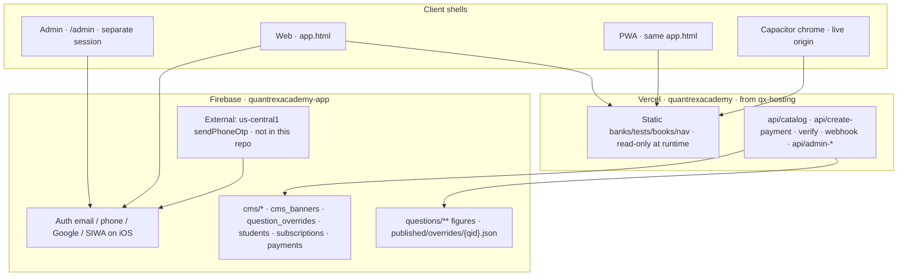
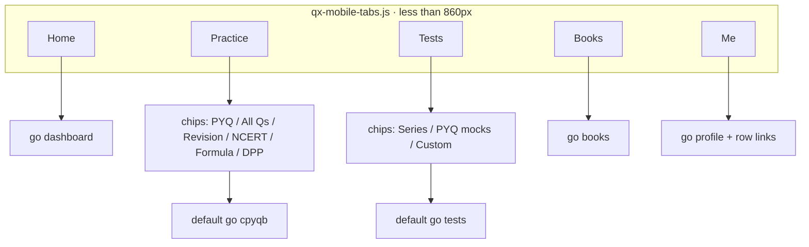
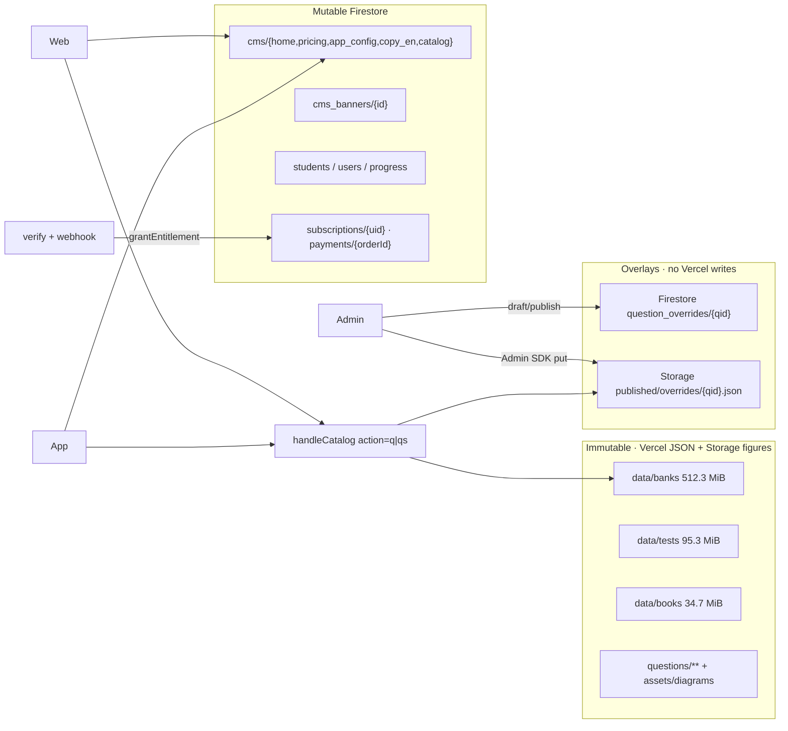
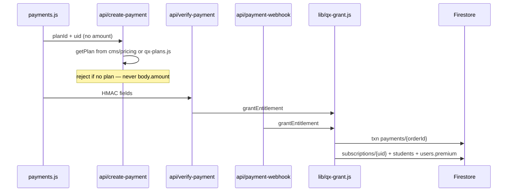
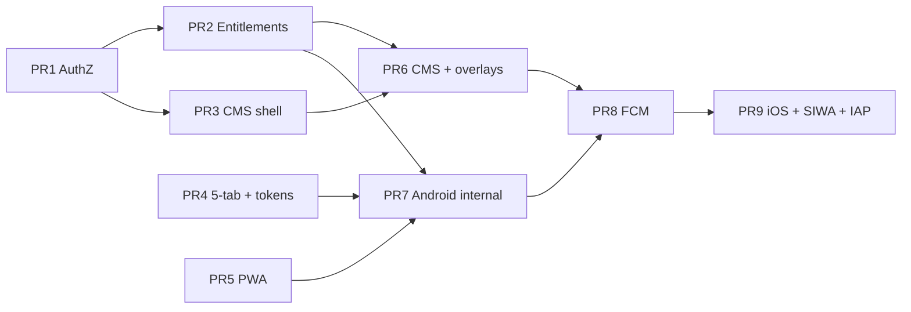

# Quantrex Academy — Connected Mobile App + Unified Admin

| Field | Value |
| --- | --- |
| **Document** | Product + systems design |
| **Product** | Quantrex Academy |
| **Author** | Systems Architect (draft for owner review) |
| **Date** | 2026-08-19 |
| **Revision** | 2 (review fixes) |
| **Status** | Draft |
| **Live SoT / deploy root** | `C:\Users\Admin\qx-hosting` **only** |
| **Live site** | https://www.quantrexacademy.com |
| **Vercel** | project **name** `quantrexacademy` (`stack-config.js`). Brief cited id `prj_xNAoquyCReVquRnrlQXZem0ExFDi` — **not in repo**; confirm in dashboard. |
| **Firebase** | `quantrexacademy-app` · bucket `quantrexacademy-app.firebasestorage.app` |
| **Student runtime** | Vanilla SPA (`app.html` + JS modules). **No React/Next rewrite.** |

`stack-config.js` `deployRoot` still points at `C:\Users\Admin\Desktop\quantrexacademy`. That path is **stale**. This program deploys from `qx-hosting` or new admin/PWA files will never ship.

Architectural decisions **D1–D22** and the ordered **PR Plan** are at the bottom of this document.

---

## Overview

Quantrex Academy is already a production vanilla SPA: students practice PYQs, take NTA-style CBTs, read digital books, and pay via Razorpay. Website and “app” today are the same `app.html` surface. What is missing is a **real admin** (`admin.html` is a client-side `ADMIN_KEY` gate; `qx-admin.js` is a 5-click local overlay) and a **store-ready mobile shell** that stays in lockstep with the website.

This design ships **one product, three shells**:

1. **Web** — existing `app.html` (responsive). Student CBT/runtime is not rewritten.
2. **App** — PWA of that surface, wrapped with **Capacitor** that loads `https://www.quantrexacademy.com`. Shared JS, CSS, JSON banks, Storage figures, Firestore identity.
3. **Admin** — protected `/admin`, Firebase Auth + custom claims (`role: super_admin`). The seed admin token is **not** used on `app.html`.

Website and app share **one database and one CDN**. Mutable product content lives in Firestore (`cms/{docId}`, `cms_banners/{id}`). Official question fixes are **Firestore overlays** (`question_overrides/{qid}`) merged **once** in `/api/catalog`. Immutable banks stay on Vercel JSON + Firebase Storage. **Never write the Vercel checkout; never Git-commit per question.** Entitlements are granted only by Admin SDK **before** any store binary. Admin password never appears in JS.

---

## Background & Motivation

### What the owner asked

From `C:\Users\Admin\Desktop\KOLP.txt`:

- Build an app **for the existing website** — same features, same content.
- Website and app **connected**: a change via admin reflects in both.
- Real **Admin section**. One login manages website + app.
- **Do not hard-code the admin password in frontend.**
- Seed super admin: mobile `7750858874`, email `quantrexacademy@gmail.com`, role `super_admin`.
- Auth = Firebase Authentication. AuthZ = custom claims + Firestore rules.
- Admin panel = protected `/admin`. Password set once via secrets/env, changeable, never shipped in JS.

### Current state (verified in `qx-hosting`)

Sizes from `os.path.getsize` on this tree, reported as MiB (`bytes / 1024²`). `.bak` files inside `data/banks` are included in the 43-file listing.

| Layer | Reality today |
| --- | --- |
| Student UI | `app.html` ~290 KiB + `app.js` ~132 KiB + `test-engine.js` ~254 KiB + 40+ modules. Desktop sidebar, mobile overlay (`assets/qx-mobile.css` `@media max-width: 860px`). Views: `dashboard`, `revision`, `tests`, `books`, `notebook`, `profile`, `assignments`, `teacher`, plus More: `cpyqb`, `allqs`, `dpp`, `formula`, `ncert`, `analytics`, `premium`, `leaderboard`, `examinfo`. Home bind: `bindDashHome` in **`marks-features.js`**, not `app.js`. |
| Fonts | Student `app.html` Google fonts link is Inter / Source Serif 4 / Literata / STIX Two / Kalam / Caveat. **Kanit is not in that link** but CSS islands (`.page-head h1`, `.logo-text`) reference it. Login loads Kanit. |
| Login | `login.html` — Mobile OTP, Email/password, Google (`signInWithPopup` then `signInWithRedirect`), guest. `vercel.json` rewrites `/` → `login.html`, `/app` → `app.html`. |
| Auth identity | `qx-student-auth.js` writes `students/{uid}` with `role: "student"`. `firebase-db.js` upserts `users/{uid}` + `users/{uid}/data/progress`. `enablePersistence` is **intentionally off** (Android IndexedDB hang comment). |
| Content path | Vercel JSON + Storage figures + Firestore identity/progress. `QxFirebaseBank` reads `questions/{id}`. Catalog: `/api/catalog` → `api/marks-question.js` → `lib/qx-catalog-server.js` (`LIMIT = 40` IDs; `action=q\|qs` via `findBankQuestion`). |
| Marks | `marks-live.js`: `STUDENT_MARKS_RUNTIME = false`. |
| Payments | Razorpay. `payments.js` → `QuantrexDB.activateSubscription` **client-writes** `subscriptions/{uid}` (rules lines 335–341 allow owner write if `orderId` is any string). `api/verify-payment.js` HMAC only — **does not grant**. `api/payment-webhook.js` **logs only**. `api/create-payment.js` lines 70–74 still accept client `body.amount` when `getPlan()` misses. `QuantrexAccess.allow()` reads **localStorage** `quantrex_sub` only; `getSubscription()` is not on `watchAuth` boot. |
| Insecure admin | `admin.html` line 56 `ADMIN_KEY = "quantrex2026"`. `qx-admin.js` 5-click. Stale folder table in `admin.html` (Class 9 “Live”) must **not** be copied — `qx-redesign-nav.js` `CLASS_EXAMS` 7–10 are Coming Soon. |
| AuthZ | `firestore.rules` `isAdmin()` = emails `quantrexacademy@gmail.com` / `ajaykumarsaroj13@gmail.com` **or** `admins/{uid}`. `qx-session.js` duplicates those emails in a **client** `ADMINS` array. `match /app/{document=**} { allow write: if isSignedIn(); }`. `users/{uid}` update blocks only `role` and `subscriptionStatus` — **not** `premium` / `planId`. |
| Branding | `app.html` theme-color `#8450CB`. `qx-redesign-v2.css` dark primary `#8450CB`. Later `qx-gemini-theme.css` (loaded after v2 in `app.html`) and `quantrex-brand.css` still Gemini `#0b57d0` / `#8ab4f8`. `theme.js` `apply()` writes `quantrex_theme` always and sets theme-color to `#2a2a2c` / `#f0f4f9`. |
| PWA / store | No `manifest.webmanifest`, no `sw.js`. Capacitor not in `package.json`. `firebase-admin` is a **devDependency** (Vercel production functions will not install it). **No `functions/` tree** in this repo; `quantrex-auth-otp.js` callables `sendPhoneOtp` on `us-central1` are an **external** system. |
| Scale | `data/banks` **512.3 MiB / 43 files** (`jee_main.json` 47.7 MiB, `neet.json` 46.2 MiB). `data/tests` **95.3 MiB / 2,298**. `data/books` **34.7 MiB / 890**. `data/books_index.json` **257 KiB**. `data/qid_marks` **53.8 MiB / 7,786**. `assets/diagrams` **21,721 files** (~859 MiB this tree) + `clean-diagrams` ~107 MiB. Examgoal 2027: 828 tests, 527 live. **Do not copy this set into a second host or into Firestore.** |

### Pain points

1. No CMS — banners/prices/copy require a code deploy.
2. Admin secret is in the public JS bundle.
3. Entitlements are client-writable (cross-device fraud, not a local skip).
4. AuthZ is email strings in rules + a JS array.
5. Mobile IA is a 16-item desktop sidebar.
6. Not installable; no store chrome.

---

## Goals & Non-Goals

### Goals

- One student product on web + PWA + Capacitor, identical academic content and entitlements.
- One seed super-admin (`quantrexacademy@gmail.com` + `+917750858874`) with claim `role: super_admin`.
- Protected `/admin` (server-checked claims). Mutating admin APIs require **step-up** (`auth_time`).
- Shared Firestore for identity, commerce, progress, CMS, overlays.
- Shared CDN/Storage for immutable banks/books/tests/figures.
- Mobile 5-tab IA reusing `go(view)` / `test-engine.js`.
- Quantrex-only student branding. No Marks / Quizrr / Examgoal chrome.
- Server-side overlay publish (Firestore + Storage object). No Vercel FS writes, no per-question git.
- Server-side entitlements **before** any store wrapper.
- FCM from admin via server (separate messaging SW).
- Incremental PRs, each with rollback + acceptance test.

### Non-Goals

- React / Next / React Native rewrite of the student CBT.
- Migrating PYQ JSON into Firestore as the content store.
- Duplicating the diagram set onto a second CDN.
- `STUDENT_MARKS_RUNTIME = true`.
- Inventing stems/options/figures/solutions (no LLM authoring).
- Celebrity / Jovi-as-product. `jovi.js` stays deferred secondary JS.
- Deleting other sites or the teacher portal.
- Admin password in any client file.
- Play/App **public listing** as a launch blocker (internal Android only until policy).
- Video-lecture product (`video.provider: "none"`).
- Re-enabling Firestore `enablePersistence` on Android/Capacitor.
- GitHub Contents API as a publish backend.
- Using the seed super-admin session to browse `app.html`.

---

## Proposed Design

### 1. Architecture — one product, three shells



Hosting stays Vercel. `firebase.json` has no hosting public dir — do not add a second public host for `/admin` (see Alternatives G).

### 2. Student app IA (mobile-first, 5 tabs) — implementation grain

Existing sidebar: `app.html` ~3748–3768. Breakpoint **860px** is already `assets/qx-mobile.css`. New files: `qx-mobile-tabs.js` + tab CSS in `qx-mobile.css`. Same `go(view, payload)` in `app.js`. **There is no `go("practice")` view** (that string appears only in error paths). The Practice tab is a **highlight set**, defaulting to `cpyqb`.

#### 2.1 Tab map

| Tab | Default `go()` | Other children | How reached on phone |
| --- | --- | --- | --- |
| **Home** | `dashboard` | none | Exam chips stay `#qxTopExams`. CMS banners + continue + today’s test injected in `bindDashHome` (`marks-features.js`). |
| **Practice** | `cpyqb` | `allqs`, `revision`, `ncert`, `formula`, `dpp` | Horizontal **chip row under the tab** (not a second bottom nav). Chip → existing `go(view)`. Coming-soon class folders stay toast (`CLASS_EXAMS` 7–10). |
| **Tests** | `tests` | `pyqmock`; `custom`; series (`test-series.js`, `TS_CFG.seriesId = "jee_main_examgoal_2027"`) | Chip row: Series · PYQ mocks · Custom. Series is the current `tests` hub. |
| **Books** | `books` | chapter reader via existing payload | No chips. |
| **Me** | `profile` | `notebook`, `analytics`, `premium`, `leaderboard`, `examinfo`, **`settings`** (new), Classroom | **List rows** on the profile page (not chips): Notebooks, Analytics, Premium / plan, Bookmarks, Leaderboard, Exam info, Settings, Classroom (`assignments` + `teacher` if enrolled). |

**Desktop ≥860px:** hide `#qxMobileTabs`. Sidebar **unchanged**, including More. Teacher Portal and Assignments stay in the desktop sidebar.

**Mobile &lt;860px:** hide the hamburger-driven More drawer as primary nav once 5-tab ships. Hamburger may still open a slim “Classroom / Teacher” sheet if needed; it is not the 16-item list.

**Highlight:** `PRACTICE_VIEWS = {cpyqb, allqs, revision, ncert, formula, dpp}`; `TEST_VIEWS = {tests, pyqmock, custom}` plus `currentView === "test"` (in-engine). Persist `localStorage.qx_mobile_tab`.

**Hide `#qxMobileTabs` when:** `.mtk-test-root.allen-cbt`, `.qzrr-cbt`, `#app-main .ct-wizard-split` (custom wizard), `.qx-paywall` overlay, `.allen-instr-foot` / instruction fullscreen, or `currentView === "question"` (practice stem uses sticky foot already).

**Bottom nav chrome:** 56px + `env(safe-area-inset-bottom)` (56–64px), 44px min tap.



This ships on **web** (PR 4) before Capacitor.

### 3. Visual design system

#### 3.1 Token cascade

| File | Dark primary | Notes |
| --- | --- | --- |
| `assets/qx-redesign-v2.css` | `#8450CB` | **Chrome SoT.** Load **after** `qx-gemini-theme.css` **or** scope Gemini to paper. |
| `assets/qx-gemini-theme.css` | `#8ab4f8` | Restrict selectors to `.mtk-test-root`, `.qx-practice-page` (NTA paper). |
| `assets/quantrex-brand.css` | `#8ab4f8` | Stop overriding `--primary` on the shell. |

**Implementation (PR 4):** in `app.html`, move `qx-redesign-v2.css` **after** gemini **or** wrap gemini rules under paper selectors. Do not leave v2 at line ~36 and gemini at ~54 as today.

#### 3.2 Color tokens

| Token | Night chrome | Day chrome | NTA paper |
| --- | --- | --- | --- |
| `--qx-purple` | `#8450CB` | `#8450CB` | n/a |
| `--qx-navy` | `#1A1030` | — | n/a |
| `--bg` | `#0B0714` | `#FAF9F6` | `#FFFFFF` |
| `--card` | `#30292F` | `#FFFFFF` | `#FFFFFF` |
| `--text` | `#F7E8CF` | `#2E2B28` | `#0f172a` |
| `--primary` | `#8450CB` | `#6B3AAF` | n/a |
| `--accent-gold` | `#EAB901` | `#C99700` | n/a |
| theme-color / splash | `#1A1030` | `#8450CB` | n/a |

Razorpay `payments.js` theme `#0b57d0` → `#8450CB`.

#### 3.3 Type

Keep `qx-typography.css`. **Add Kanit** (`family=Kanit:wght@600;700;800`) to the `app.html` font `<link>` so existing `.logo-text` / `.page-head h1` match login.

| Role | Face | Size |
| --- | --- | --- |
| UI | Inter 400–700 | 13–15px |
| Display | Kanit 800 | 22–26px |
| Question | Source Serif 4 | **16px** / lh 1.65 |
| Math | KaTeX + STIX Two | **1.15em** |
| A−/A+ | `quantrex_test_font` + `--qx-content-zoom` | 14 / 16 / 18 / 21; zoom 0.5–3.0 |

Motion: chrome 150–200ms; keep `prefers-reduced-motion`.

#### 3.4 Night / 6am language + theme.js fix

IST greeting on Home (`marks-features.js` / dashboard, not a new framework):

| Hour IST | Greeting |
| --- | --- |
| 00:00–05:59 | Good night |
| 06:00–11:59 | Good morning |
| 12:00–16:59 | Good afternoon |
| 17:00–20:59 | Good evening |
| 21:00–23:59 | Good night |

**`theme.js` today is incompatible with auto theme:** `init()` calls `apply("dark")` which **writes** `quantrex_theme`, so the user “has set” dark after one visit; `apply()` also clobbers theme-color to Gemini greys.

**New contract:**

- `quantrex_theme` = user choice (`light` \| `dark`) **or absent**.
- `apply(mode, { persist })` writes localStorage **only if** `persist === true` (toggle / Settings).
- `init()`: if key present → apply user choice with `persist: false`; else auto night chrome 18:00–05:59 IST, day 06:00–17:59, **do not write** the key.
- theme-color: night `#1A1030`, day `#8450CB`. Never `#2a2a2c` / `#f0f4f9`.
- Existing users who already have `quantrex_theme=dark` keep dark (that is a real choice under the old code). Auto applies to **new** installs / after user taps “Match time of day” in Settings (clears the key).

#### 3.5 Splash

`assets/quantrex-logo-3d-512.png` on `#1A1030`, wordmark Quantrex Academy, tagline **Concepts Create Destiny**. No third-party marks.

### 4. Screen inventory

| # | Screen | Shell | Building block |
| --- | --- | --- | --- |
| S1 | Splash | App / PWA | `native-shell/splash.html` |
| S2 | Login / OTP | Web + App | `login.html`. iOS binary: + SIWA. Capacitor: Google/Razorpay in system browser. |
| S3 | Home | Student | `dashboard` + `bindDashHome` |
| S4 | Class folders | Student | `qx-redesign-nav.js` 7–10 Coming Soon |
| S5–S6 | Subject / chapter | Student | `cpyqb` + folder-icons |
| S7 | Practice Q | Student | practice + `math-render.js` |
| S8–S10 | CBT instr / paper / result | Student | `allen-test-ui.js`, `test-engine.js` |
| S11–S12 | Custom / series | Student | `custom-test.js`, `test-series.js` |
| S13–S14 | Books | Student | `books`, `book-covers.js` |
| S15–S16 | Paywall / checkout | Student | `qx-access.js`, `pay.html` — server grant |
| S17–S18 | Me / Settings | Student | `profile` + new `settings` |
| S19 | Force-update | App | `cms/app_config` |
| S20 | Admin login | Admin | `/admin` only |
| S21–S29 | Admin modules | Admin | after PR 3 shell; editors PR 6 |
| S30 | Teacher login | Existing | `teacher-login.html` |

### 5. Shared data (lockstep)



**Rules of the data plane**

1. One Firebase project, one Vercel origin. No second student DB.
2. Students page 40 IDs (`qx-catalog.js`). They never download `jee_main.json` whole.
3. Figures via `QxFirebaseBank.ownedFigureUrl`. Client Storage write stays `false` for `questions/**`.
4. **Overlay persistence (only path):** Firestore `question_overrides/{qid}` is the admin SoT. Publish copies a **public** JSON object to Storage `published/overrides/{qid}.json` via Admin SDK. `/api/catalog` merges that object. **Never** `fs.writeFile` on Vercel. **Never** GitHub Contents. **Never** rewrite `data/banks/*.json`.
5. Revert = delete Storage object + set overlay `status: "reverted"`. Official JSON is untouched.
6. `content_health/summary` stays the health card.

### 6. Overlay merge (single layer)

Student question fetch order after this design:

1. **`GET /api/catalog?action=q|qs`** — `findBankQuestion` then `applyPublishedOverlay`.
2. `QxFirebaseBank.getQuestion` only on catalog miss (existing Firestore `questions/{id}`). **Does not** read `question_overrides`.
3. `data/qid_marks/{id}.json` last (offline shards in `api/marks-question.js`).

`qx-catalog.js` `applyCatalogRec` stays a hydrator for Marks-shaped HTML vs bank HTML. **It must not apply CMS overlays.** If it did, `keepMatch` / `keepRicherFig` could drop a published typo-fix, or a bad overlay could strip List-I/II tables.

```js
// lib/qx-overlay.js — used only inside handleCatalog (action=q|qs)
const OVERLAY_FIELDS = ["q", "options", "answer", "answers", "solution", "figurePath"];

function applyPublishedOverlay(official, overlay) {
  if (!official || !overlay || overlay.status !== "published") return official;
  const out = { ...official };
  for (const field of OVERLAY_FIELDS) {
    const v = overlay[field];
    if (v === undefined || v === null || v === "") continue; // empty = leave official
    out[field] = v;
  }
  out._overlayAt = overlay.updatedAt || null;
  return out;
}
```

**Fixture (required in PR 6):** match-list official item + stem-only overlay (`q` set, `options` empty) → List-I/II tables and option figures still present.

**Cache:** `action=q|qs` responses use `Cache-Control: private, no-store` (today `api/marks-question.js` sets `public, max-age=300` and `vercel.json` `/api/(.*)` is `s-maxage=120, stale-while-revalidate=600`). Listing `action=courses|chapters|questions` stays cacheable. Overlay Storage objects: `Cache-Control: private, max-age=0` at upload + catalog no-store so publish is visible on the next question fetch.

### 7. Admin

#### 7.1 Identity and roles

| Field | Value |
| --- | --- |
| Email | `quantrexacademy@gmail.com` |
| Phone | `+917750858874` |
| Claim | `{ role: "super_admin" }` |
| Password | `SUPER_ADMIN_INITIAL_PASSWORD` env only. First login `mustResetPassword`. |

**Role enum** (claims + `admins/{uid}.role`):

| Role | May call |
| --- | --- |
| `super_admin` | All `api/admin-*`, including publish, grant, claims, notify |
| `operator` | Banners, copy, reports, student **read**; **not** publish, grant, claims, seed |

`ajaykumarsaroj13@gmail.com` is **not** auto-claimed `super_admin`. It remains a **time-boxed fallback** in `firestore.rules` + `lib/qx-admin-guard.js` (`LEGACY_ADMIN_EMAILS`) so today’s operator is not locked out. After soak (PR 1b), remove the fallback; if they still need access, a super_admin sets `operator` or `super_admin` via `POST /api/admin-claims`. **Never put this list in `qx-session.js`.**

Login for `/admin` only: email+password **and** phone OTP. OTP uses **external** Cloud Functions `sendPhoneOtp` on `us-central1` (not in `qx-hosting`). If Functions are down, email/password still works. Recaptcha-in-WebView is not an admin path (admin is a mobile browser / tablet Chrome, not Capacitor).

`login.html` must **not** auto-redirect a `super_admin` into `app.html`. Show: “This is the student app. Admin is at /admin. Dogfood with a student account.”

#### 7.2 Seed runbook (PR 1)

Move `firebase-admin` to **`dependencies`**. Singleton `lib/qx-firebase-admin.js` (`initializeApp` once from `FIREBASE_SERVICE_ACCOUNT` JSON env).

`POST /api/admin-seed` (`x-admin-seed: ADMIN_SEED_TOKEN`):

1. If Firestore `admin_seed/lock.done == true` → 409, no-op.
2. `getUserByEmail(email)` and `getUserByPhoneNumber(phone)` (catch `auth/user-not-found`).
3. **Link to one uid:**
   - Neither → `createUser({ email, password, phoneNumber, emailVerified: true })`.
   - Email only → `updateUser` set `phoneNumber` + password if missing.
   - Phone only → `updateUser` set email + password; verify email.
   - Both, **different uids** → keep email uid; `updateUser(emailUid, { phoneNumber })` if unique; do **not** silently delete the phone uid — log both uids and fail if phone number cannot be attached (operator links in Console). Prefer explicit failure over merging the wrong student account.
4. `setCustomUserClaims(uid, { role: "super_admin" })`.
5. `admins/{uid}` `{ role, email, phone, mustResetPassword: true, seededAt }`.
6. `admin_seed/lock` `{ done: true, uid, ts }`.
7. Response `{ ok, uid }`. Operator **deletes `ADMIN_SEED_TOKEN` from Vercel env** after success (lock is the durable switch even if env lingers).

`/admin` boot: `getIdToken(true)` so claims appear. If `mustResetPassword`, force `updatePassword` before modules.

#### 7.3 Admin XSS control (seed token ≠ student SPA)

`app.html` is a large HTML/KaTeX XSS surface. A super_admin ID token on that origin can call `api/admin-*`.

**Controls (all required):**

1. **Operational:** dedicated browser profile for `/admin`. Dogfood CBT with a **student** uid.
2. **Step-up:** mutating `api/admin-*` (`publish`, `upload`, `grant`, `notify`, `claims`) require `decoded.auth_time >= now - 15 minutes`. Else 401 `{ code: "auth/step-up-required" }`; `admin.html` reauthenticates (password or OTP) then `getIdToken(true)`.
3. **GET** `api/admin-session` / `api/admin-students` allow tokens up to 1 hour but **no-store** + no `Access-Control-Allow-Origin: *`.
4. Do not teach “open student app as super_admin”.

#### 7.4 Guard + cache (PII)

```js
// lib/qx-admin-guard.js
const { LEGACY_ADMIN_EMAILS } = require("./qx-legacy-admins");
const STEP_UP_SEC = 15 * 60;

function setAdminHeaders(res) {
  res.setHeader("Cache-Control", "no-store");
  res.setHeader("X-Content-Type-Options", "nosniff");
  // no Access-Control-Allow-Origin
}

async function requireRole(req, res, { roles, stepUp }) {
  setAdminHeaders(res);
  // verifyIdToken; role claim or (legacy email AND soak not ended)
  // if stepUp && now - auth_time > STEP_UP_SEC → 401 step-up
}
```

`vercel.json` **must** special-case admin APIs the same way payments already do:

```json
{ "source": "/api/admin-(.*)", "headers": [{ "key": "Cache-Control", "value": "no-store" }] }
```

The catch-all `{ "source": "/api/(.*)", "s-maxage=120" }` **must not** win. Payments already learned this. Also `no-store` on `/admin`, `/admin.html`. **Do not** copy `Access-Control-Allow-Origin: *` from `create-payment.js`.

#### 7.5 Modules

| Module | Storage | Student effect |
| --- | --- | --- |
| Catalog tree | `cms/catalog` | Folder hide / comingSoon / order |
| Question editor | `question_overrides/{qid}` + Storage publish | Next `/api/catalog?action=q` |
| Tests / books visibility | `cms/catalog` | Tabs |
| Students | `GET /api/admin-students` | Search; no full collection dump |
| Payments | Razorpay dashboard + `payments/{orderId}` | Read |
| Pricing | `cms/pricing` | `getPlan()` CMS then file |
| Banners | `cms_banners/{id}` | Home `onSnapshot` |
| Copy | `cms/copy_en` | Paywall / guest strings |
| Force-update | `cms/app_config` | S19 |
| Notify | PR 8 | FCM |
| Audit | `admin_audit/{id}` Admin SDK only | S29 |

Question editor: **existing official item only**. No “Generate with AI”. No blank new official PYQ. Empty overlay fields = leave official.

### 8. Payments — server entitlements (before any store binary)



**`grantEntitlement({ uid, plan, orderId, paymentId, source })`** in `lib/qx-grant.js`:

1. Require `uid`, `plan.id`, `orderId`.
2. Firestore transaction on `payments/{orderId}` (doc id = Razorpay order id).
3. If `status === "granted"` → return existing (idempotent verify+webhook).
4. Else set `{ uid, planId, paymentId, amount, features, source, status: "granted", ts }`.
5. Admin SDK set `subscriptions/{uid}` `{ uid, active: true, planId, orderId, features, expiresAt, startedAt }`.
6. Admin SDK set `students/{uid}` `{ subscriptionStatus: "active", subscriptionPlan, subscriptionStartDate, subscriptionEndDate }` and `users/{uid}` `{ premium: true, planId, subscriptionStartDate, subscriptionEndDate }` — fields the client **must no longer write**.

**Rules (PR 2):**

- `subscriptions/{userId}`: `allow write: if false`; read owner or admin.
- `users/{userId}` update: also block `premium`, `planId`, `subscriptionStartDate`, `subscriptionEndDate`.
- `students/{studentId}` already blocks `subscriptionStatus` / `subscriptionPlan` for owners — keep.
- `payments/{paymentId}` stays client `write: false`; Admin SDK writes `payments/{orderId}`.

**`QuantrexDB.activateSubscription`:** delete grant writes. Replace with `applySubscriptionSnapshot(data)` that only updates localStorage from **server** data.

**`QuantrexAccess` SoT:**

- Boot (`watchAuth`): `getSubscription(uid)` + `watchSubscription(uid)`.
- `paidSub()` uses memory from last Firestore snapshot, then localStorage only as offline cache of that snapshot (include `source: "server"` + `expiresAt`).
- If snapshot loaded and `active !== true` → **fail closed** (paywall), even if localStorage was forged.
- If logged in and snapshot **not yet** loaded → listings allowed; item open shows a short spinner, then paywall on timeout (2s), not a free pass.
- Guest peek logic unchanged (`quantrex_free_peeks`).

**`api/create-payment.js`:** if `!getPlan(...)` return **400**. Delete the `body.amount` branch.

Flag `serverEntitlements` is a **kill switch after** a verified ₹10 payment on prod, not a substitute for this PR.

### 9. Student CMS client (live lockstep)

`qx-cms.js`:

- `onSnapshot` on `cms/home`, `cms/pricing`, `cms/app_config`, `cms/copy_en`, and `cms_banners` where `active == true`.
- In-memory cache with **30s TTL** only as a fallback if the listener errors.
- Home re-paints banners on snapshot (owner brief: change reflects without waiting for the next cold start).
- Missing docs → current hard-coded strings (`qx-guest-trial.js`, `qx-access.js`, `lib/qx-plans.js`).

v1 query: `cms_banners` `where active==true` **without** `orderBy` (sort `order` in JS) **or** add composite index (see Data Model). Prefer **sort in JS** for v1 to avoid a blocked first paint if the index is late.

### 10. Capacitor / store shell

**PR 7 is internal-track Android only. No Play public listing until a digital-goods policy path is chosen (PR 9 / owner).** A WebView against production with client-writable `subscriptions` is forbidden — PR 2 must land first.

#### 10.1 Host allowlist (from live SPA, not a guess)

Capacitor `server.allowNavigation` **and** Android/iOS ATS / network security config must include:

| Host | Why |
| --- | --- |
| `www.quantrexacademy.com`, `quantrexacademy.com` | App origin |
| `quantrexacademy-app.firebaseapp.com` | `authDomain` |
| `identitytoolkit.googleapis.com`, `securetoken.googleapis.com` | Auth API |
| `firestore.googleapis.com` | Firestore |
| `firebasestorage.googleapis.com`, `quantrexacademy-app.firebasestorage.app` | Figures |
| `www.googleapis.com` | Firebase APIs |
| `www.google.com`, `www.gstatic.com` | reCAPTCHA (`quantrex-auth-otp.js`) |
| `accounts.google.com` | Google sign-in |
| `fonts.googleapis.com`, `fonts.gstatic.com` | Fonts |
| `cdn.jsdelivr.net` | KaTeX |
| `checkout.razorpay.com`, `api.razorpay.com` | Checkout |

Do **not** allow-navigate the whole internet.

#### 10.2 Auth in the WebView

- **Google:** do not rely on `signInWithPopup` inside Capacitor. Use **Capacitor Browser** (Chrome Custom Tabs / SFSafariViewController) + `signInWithRedirect` return to `https://www.quantrexacademy.com/login.html`. Authorized domains: add none if we stay on the live origin. If popup is used on web, Capacitor branch uses Browser.
- **Razorpay:** same — system browser / Custom Tab if in-WebView checkout fails or Play 3.1.1 requires it.
- **Phone OTP:** Cloud Function-first (`sendPhoneOtp`). RecaptchaVerifier in WebView is a known failure; fallback: email/password, or open Browser for reCAPTCHA. Document Functions as **external** (no `functions/` in this repo).
- **iOS:** if Google Sign-In ships in the binary, **Sign in with Apple is required** (App Store 4.8). Firebase `OAuthProvider("apple.com")`. Map to the same Firebase uid. **SIWA is an iOS launch requirement** (PR 9), not optional polish.

#### 10.3 Offline / persistence

Do **not** turn `enablePersistence` back on. Capacitor is the Android WebView that comment warned about.

Offline = PWA `sw.js` navigation shell + Cache API for **last-opened chapter ID list and last N question payloads already fetched**. Not a bundled bank. Apple 4.2: native splash, status bar, back button, force-update, push (PR 8), last-chapter cache, SIWA — not a naked Safari bookmark.

#### 10.4 Service workers (two files)

| File | Role |
| --- | --- |
| `/sw.js` | PWA navigation shell. Precache login + app chrome CSS/JS. **Never** precache `data/banks`, `assets/diagrams`, `admin.html`. |
| `/firebase-messaging-sw.js` | FCM background handler only. |

Do **not** merge them. Do **not** add a no-op `vercel.json` rewrite `{ source: "/sw.js", destination: "/sw.js" }`. Header: `/sw.js` `Cache-Control: max-age=0, must-revalidate`.

`app.html` today loads only app/auth/firestore. Messaging SDK + `firebase-messaging-sw.js` land in **PR 8**, not the PWA PR.

---

## API / Interface Changes

### Student

| Endpoint | Change |
| --- | --- |
| `GET /api/catalog` | `action=q\|qs`: merge Storage overlay; `Cache-Control: private, no-store`. Other actions unchanged cache. |
| `GET/POST /api/create-payment` | Plans from `cms/pricing` with `lib/qx-plans.js` fallback. **No client amount.** `uid` required. |
| `POST /api/verify-payment` | HMAC then `grantEntitlement`. |
| `POST /api/payment-webhook` | Signature then `grantEntitlement`. |
| `GET /manifest.webmanifest` | New (PR 5). |
| `GET /sw.js` | New (PR 5). |
| `GET /firebase-messaging-sw.js` | New (PR 8). |

### Admin (all `no-store`, no `*`)

| Endpoint | Auth | Purpose |
| --- | --- | --- |
| `POST /api/admin-seed` | `ADMIN_SEED_TOKEN` + lock doc | Link email+phone, claim, lock |
| `GET /api/admin-session` | Bearer, 1h | `{ ok, role, uid }` |
| `POST /api/admin-claims` | super_admin + step-up | Set `super_admin` \| `operator` |
| `POST /api/admin-publish` | super_admin + step-up | Overlay → Storage |
| `POST /api/admin-upload` | super_admin + step-up | Banner/PDF via Admin SDK |
| `GET /api/admin-students` | super_admin \| operator | Paginated search |
| `POST /api/admin-grant` | super_admin + step-up | Comp / revoke (Admin SDK) |
| `POST /api/admin-notify` | super_admin + step-up | FCM (PR 8) |
| `POST /api/admin-iap-verify` | PR 9 | Store purchase → same grant |

`requireRole` lives in `lib/qx-admin-guard.js`. Legacy emails only there + rules.

---

## Data Model Changes

### Existing — tighten

| Path | Change |
| --- | --- |
| `subscriptions/{uid}` | Client write **false**. Server grant only. |
| `users/{uid}` | Also lock `premium`, `planId`, `subscriptionStartDate`, `subscriptionEndDate`. |
| `app/{document=**}` | Write **admin only** (today any signed-in user). PR 1. |
| `payments/{orderId}` | Admin SDK grant lock. Client write stays false. |
| `admins/{uid}` | Client write stays false. |
| `students/{uid}` | Unchanged owner restrictions. |

### New — **even-length paths only**

Firestore paths are `collection/doc` (optionally nested even segments). Invalid sketches like `cms/question_overrides/{qid}` (3 segments) are **out**.

| Path | Read | Write | Notes |
| --- | --- | --- | --- |
| `cms/home` | public | admin | singleton |
| `cms/pricing` | public | admin | |
| `cms/app_config` | public | admin | flags, min versions |
| `cms/copy_en` | public | admin | |
| `cms/catalog` | public | admin | |
| `cms_banners/{id}` | public | admin | `{ title, imageUrl, href, exam, active, order, startsAt, endsAt }` |
| `question_overrides/{qid}` | **admin only** | admin | drafts + published copy. Students **never** read this. |
| `admin_audit/{id}` | admin | false (SDK) | |
| `admin_seed/lock` | false | false (SDK) | |
| `question_reports/{id}` | owner or admin | create: owner | from Report Question UI |
| `users/{uid}/devices/{deviceId}` | owner | owner, keys `token`, `platform`, `updatedAt` only | PR 8 |

```
match /cms/{docId} {
  allow read: if true;
  allow write: if isAdmin();
}
match /cms_banners/{id} {
  allow read: if true;
  allow write: if isAdmin();
}
match /question_overrides/{qid} {
  allow read, write: if isAdmin();
}
match /admin_audit/{id} {
  allow read: if isAdmin();
  allow write: if false;
}
match /question_reports/{id} {
  allow create: if isSignedIn() && request.resource.data.uid == request.auth.uid;
  allow read: if isAdmin() || resource.data.uid == request.auth.uid;
  allow update: if isAdmin();
}
match /users/{userId}/devices/{deviceId} {
  allow read, write: if isOwner(userId)
    && request.resource.data.keys().hasOnly(['token', 'platform', 'updatedAt']);
}
match /app/{document=**} {
  allow read: if true;
  allow write: if isAdmin();
}
```

`isAdmin()` = claim `super_admin` **or** `operator` **or** `admins/{uid}` **or** (soak) `LEGACY_ADMIN_EMAILS`. Publish/grant APIs still require `super_admin` claim (or soak legacy email) in the **server guard**, which is stricter than rules.

### Indexes (`firestore.indexes.json`)

| Query | Fields | PR |
| --- | --- | --- |
| Optional banners | `cms_banners`: `active` ASC, `order` ASC | Skip v1; sort in JS |
| Reports inbox | `question_reports`: `status` ASC, `ts` DESC | 6 |
| Audit | `admin_audit`: `uid` ASC, `ts` DESC | 3 (UI query) |

Existing `questions` / `tests` / `attempts` indexes stay.

### Overlay Storage object

Path: `published/overrides/{qid}.json`  
ACL: public read (same as figures) **or** signed URL from catalog server using Admin SDK. Prefer **Admin SDK download inside `handleCatalog`** (no public listing of drafts). Catalog already runs on the server.

`storage.rules`: add

```
match /published/overrides/{file} {
  allow read: if false;  // Admin SDK / function only
  allow write: if false;
}
```

### Audit TTL

UI queries last 90 days. Weekly `api/admin-audit-gc.js` (Vercel cron secret, not public): delete `admin_audit` where `ts < now-90d`. No new SaaS.

### Migration

1. PR 1 rules (claim OR legacy email OR `admins/{uid}`). Lock `app/{**}`.
2. Seed + lock. Force token refresh.
3. PR 2 grants + lock subscription/premium fields after ₹10 proof.
4. Seed `cms/*` from current copy (`qx-guest-trial.js`, `lib/qx-plans.js`, `CLASS_EXAMS`).
5. After soak, PR **1b**: delete `LEGACY_ADMIN_EMAILS` from rules + guard.
6. Never batch-import banks into `questions/*`.

CMS volume: &lt; 1 MB + small overlays. Academic bytes stay on Vercel.

---

## Alternatives Considered

### A. React Native / Flutter rewrite

Rejected. Forks CBT + 50k questions; breaks lockstep.

### B. All PYQs in Firestore

Rejected. 512 MiB banks, 1 MB/doc, cost; catalog exists because full banks must not go to the browser.

### C. TWA instead of Capacitor

Fallback on Android if Play prefers PWA. iOS still needs Capacitor. Capacitor remains the wrapper; TWA is not the default.

### D. Keep `ADMIN_KEY` but fetch from env

Rejected. Shared password, no identity, no audit.

### E. Bundle banks in the APK

Rejected. Size + desync.

### F. Overlay store: Firestore-only vs Storage sidecar vs git

| Option | Verdict |
| --- | --- |
| GitHub commit per qid | **No.** Redeploys a 512 MiB+ repo; no token in `api/*` today. |
| Write `data/overrides/` on Vercel | **No.** Serverless FS is ephemeral except `/tmp`. |
| Firestore `question_overrides/{qid}` only | Viable; every `action=q` hits Firestore. |
| Firestore SoT + Storage `published/overrides/{qid}.json` | **Chosen.** Admin SDK put; `handleCatalog` reads Storage/Admin; Revert deletes object. |

Remote Config for force-update: skip. `cms/app_config` already covers flags + min versions without another product.

### G. Admin SDK home: Vercel `api/admin-*` vs Cloud Functions

**Chosen: Vercel `api/admin-*`** next to Razorpay (`api/create-payment.js` already serverless). One deploy root (`qx-hosting`).

OTP **stays** on existing `us-central1` callables because that code is **not in this repo**; rewriting OTP onto Vercel is out of scope and risks locking students out. Two Admin SDK homes are accepted: Functions for OTP (external), Vercel for admin/pay/catalog overlay.

Firebase Hosting **only** for `/admin`: rejected. Splits auth domain, cookies, and deploy; `/admin` is a rewrite on the same Vercel project.

---

## Security & Privacy Considerations

```mermaid
flowchart TB
  Attacker --> KEY[ADMIN_KEY in JS · today]
  Attacker --> SUB[client subscriptions write · today]
  Attacker --> APP[app/{**} signed-in write · today]
  Attacker --> XSS[XSS on app.html + admin token]
  KEY -.->|PR1 delete| Gone1[gone]
  SUB -.->|PR2 grantEntitlement| Gone2[gone]
  APP -.->|PR1 lock| Gone3[gone]
  XSS -.->|step-up + no admin on app.html| Mitigated
```

### T1 Admin takeover — critical today

| Vector | Mitigation |
| --- | --- |
| `ADMIN_KEY` | Delete in PR 1 |
| 5-click | Demote / delete listener |
| Email-in-rules | Soak only, server+rules module, then claims |
| Seed left open | `admin_seed/lock` + remove env token |
| Email vs phone two uids | Seed lookup+link; fail loud |
| XSS + admin token on `app.html` | Do not dogfood as super_admin; 15 min `auth_time` on mutating APIs |

Rotate any chat-shared password before production. 2FA on the Google account for `quantrexacademy@gmail.com`.

### T3 Paywall bypass — critical today

Client `activateSubscription` + owner-writable `subscriptions` + writable `users.premium` + `create-payment` `body.amount`. Closed in PR 2 as specified in §8. Idempotent on `payments/{orderId}`.

### T4 Content

Public HTTP banks are accepted. Tamper path is Admin SDK only.

### T5 PII

`GET /api/admin-students` paginated; **no-store**; no `*`. `question_reports` per uid. “Download my data” is the signed-in student only (old 5-click export).

### T6 Open rules

`app/{**}` and `subscriptions` and `users.premium` — PRs 1–2.

AuthN: Capacitor stays on `www.quantrexacademy.com` so authorized domains already listed in `firebase-config.js` comments apply. Public `apiKey` is a client key, not an admin secret.

---

## Observability

**Logs:** `admin_audit` for mutates; Vercel logs for functions. **Do not** log tokens, passwords, Razorpay secrets, or full stems.

**Metrics:** no new SaaS. Emit one JSON line Vercel can filter:

```json
{"qx_metric":"admin.login.success","uid":"...","ts":"..."}
```

Names: `admin.login.success|denied`, `cms.publish.count`, `pay.grant.success|fail`, `pay.webhook.invalid_sig`, `app.force_update.hits`.

**Alerts:** invalid_sig spike; zero grants while Razorpay shows paid; seed email login denied (claims missing → force refresh / re-seed); 5xx on `admin-publish`.

**Seed email login denied runbook:** (1) `getIdToken(true)` (2) Console → user → custom claims `role` (3) `admin_seed/lock` uid vs Auth uid (4) legacy email still in rules during soak (5) do not debug by putting emails back in `qx-session.js`.

---

## Rollout Plan

Flags on `cms/app_config.flags` (defaults):

| Flag | Default | Meaning |
| --- | --- | --- |
| `mobileBottomNav` | true after PR 4 | 5-tab &lt;860px |
| `cmsHomeBanners` | false until PR 6 | snapshots on Home |
| `claimsRequired` | false until PR 1b | drop legacy emails |
| `serverEntitlements` | true after ₹10 proof | kill switch only |
| `forceUpdate` | false | S19 |

**Order is the PR Plan at the bottom.** Capacitor (PR 7) is after entitlements (PR 2) and 5-tab (PR 4). Public stores are PR 9 + owner policy, not PR 7.

Rollback: Vercel rollback reverts web + Capacitor (live origin). PWA: `QX_BUILD` query + `sw.js` skipWaiting. Entitlements: replay Razorpay webhook; **do not** re-open client writes.

Latency: Home CMS snapshots &lt; 200ms p50 extra; catalog overlay +1 Storage get on `action=q` only; CBT 60fps unchanged.

---

## Open Questions

Resolved in this revision: overlay target (D16); entitlement SoT (D17); SIWA / no public Play listing (D18); catalog-only merge (D19); admin token not on `app.html` (D20); `ajaykumarsaroj13@gmail.com` = soak fallback, not auto `super_admin` (D21).

Still need a **runtime check**, not a product fork:

1. **Seed-time:** are `quantrexacademy@gmail.com` and `+917750858874` already one Firebase uid? Runbook handles both; operator must not force-merge if the phone uid is a real student.
2. **Play 3.1.1 path for public listing:** Razorpay in system browser vs Play Billing. PR 7 stays internal until this is chosen.
3. Confirm OTP Functions remain healthy (`sendPhoneOtp`) before promising phone login on `/admin` in production.

---

## Risks

| Risk | Severity | Mitigation |
| --- | --- | --- |
| Lock out live admin emails | high | Legacy list in rules+guard only; PR 1b after soak |
| Ship Capacitor before grant | high | PR 7 depends on PR 2 |
| CDN cache of `admin-students` | high | `no-store` source + handler |
| Overlay vs `applyCatalogRec` | medium | Server merge only; fixture |
| Two uids email/phone | medium | Seed fail-loud |
| Recaptcha in WebView | medium | Function-first OTP; Browser fallback |
| Apple 4.2 / 4.8 | medium | Native chrome + SIWA on iOS |
| `firebase-admin` not in production install | high | Move to `dependencies` |
| SW caching `admin.html` or banks | medium | Precache denylist |
| CSS load order | low | PR 4 cascade |

---

## References

- Owner brief: `C:\Users\Admin\Desktop\KOLP.txt`
- SoT: `C:\Users\Admin\qx-hosting` (not `stack-config.js` `deployRoot`)
- Student: `app.html`, `app.js`, `marks-features.js` (`bindDashHome`), `qx-redesign-nav.js`, `qx-mobile.css`
- CBT: `test-engine.js`, `allen-test-ui.js`, `math-render.js`, `qx-font-scale.css`, `qx-math-nta.css`, `qx-typography.css`
- Catalog: `qx-catalog.js` `applyCatalogRec`, `lib/qx-catalog-server.js` `handleCatalog` / `findBankQuestion` / `BANK_FILES`
- Auth: `firebase-config.js`, `firebase-db.js`, `qx-student-auth.js`, `quantrex-auth-otp.js`, `qx-session.js`, `login.html`
- Pay: `qx-access.js`, `payments.js`, `lib/qx-plans.js`, `api/create-payment.js`, `api/verify-payment.js`, `api/payment-webhook.js`
- Admin today: `admin.html` `ADMIN_KEY`, `qx-admin.js`
- Rules: `firestore.rules`, `storage.rules`, `firestore.indexes.json`
- Brand: `qx-redesign-v2.css`, `qx-gemini-theme.css` load order, `theme.js`
- Marks off: `marks-live.js`
- Series: `data/tests/jee_main_examgoal_2027/manifest.json`

---

## Key Decisions

| # | Decision | Rationale |
| --- | --- | --- |
| D1 | One product, three shells. No RN rewrite. | Existing NTA CBT + 50k banks. |
| D2 | Capacitor loads live `www.quantrexacademy.com` with native chrome (splash, status bar, back, last-chapter cache). Host allowlist from real network calls. No bundled banks. | Lockstep; APK size; Apple 4.2 ≠ naked WebView. |
| D3 | Split data plane: Vercel JSON + Storage figures vs Firestore CMS/identity/commerce/overlays. | 512 MiB banks; 1 MB/doc. |
| D4 | Claims `role: super_admin \| operator` are AuthZ SoT. Legacy emails soak-only in **rules + `lib/qx-admin-guard.js`**, never `qx-session.js`. | Phone login; stop editing JS to add admins. |
| D5 | Delete `ADMIN_KEY`; demote 5-click to student self-export. | Public bundle. |
| D6 | Seed via Admin SDK + env; lookup email **and** phone; link or fail-loud; `admin_seed/lock`; `getIdToken(true)`; `firebase-admin` in `dependencies`. | Two-uid trap; Vercel prod install. |
| D7 | Admin publish is Admin SDK only. No Vercel FS, no git per question, no client Storage `questions/**`. | Serverless FS is ephemeral; repo too large to commit sidecars. |
| D8 | Overlays: Firestore `question_overrides/{qid}` SoT + Storage `published/overrides/{qid}.json`. | Durable; catalog can merge without rewriting 47.7 MiB files. |
| D9 | Entitlements: `grantEntitlement` from verify **and** webhook; idempotent `payments/{orderId}`; client subscription/premium writes false; `QuantrexAccess` boots from Firestore. | Today’s hole is cross-device fraud. |
| D10 | 5 tabs with chips/rows as specified; desktop sidebar ≥860px unchanged. Web PR before Capacitor. | Store IA without inventing a parallel router. |
| D11 | `qx-redesign-v2.css` wins chrome; Gemini scoped to paper. `theme.js` persist only on user toggle; theme-color `#1A1030` / `#8450CB`. | Current cascade + `apply()` write fight the brand. |
| D12 | Same `uid` on web and app. | Existing `firebase-db.js`. |
| D13 | Do not lock out legacy emails during soak. | Live operators. |
| D14 | Teacher portal out of `/admin` and out of 5-tab. | Different role. |
| D15 | Jovi not in this program. | Owner constraint. |
| D16 | Overlay persistence = Firestore + Storage object **only**. | Issue 1; Vercel FS/git are non-starters. |
| D17 | Entitlement SoT = Firestore `subscriptions/{uid}` granted by server; `QuantrexAccess` fail-closed on server snapshot; lock `users.premium`. | Issue 2. |
| D18 | SIWA required on iOS if Google is in the binary. Play **public** listing blocked until IAP/Razorpay-in-browser policy. PR 7 = internal Android. | 4.8 / 3.1.1. |
| D19 | Overlay merge **once** in `handleCatalog` for `action=q\|qs`. `applyCatalogRec` does not re-apply CMS. Empty overlay field = leave official. | Issue 7 vs `keepMatch`. |
| D20 | Seed admin session is not used on `app.html`. Mutating admin APIs need `auth_time` ≤ 15 min. | XSS → admin writes. |
| D21 | `ajaykumarsaroj13@gmail.com` is soak **fallback**, not auto-claimed `super_admin`. Ongoing access = `POST /api/admin-claims`. | Stops a second immortal god account. |
| D22 | CMS Home uses Firestore `onSnapshot` (30s TTL fallback). OTP Functions remain external. Two service workers (`sw.js` ≠ `firebase-messaging-sw.js`). | Lockstep; don’t collide FCM with PWA. |

---

## PR Plan

Each PR is independently reviewable. **Do not** merge a client password or re-open `subscriptions` writes.

### PR 1 — Admin AuthZ: claims, seed, kill `ADMIN_KEY`, lock `app/{**}`

- **Title:** `security: Firebase admin claims, seed lock, delete ADMIN_KEY`
- **Files / components:** `admin.html` (login + session only; **no** CMS modules); `api/admin-seed.js`; `api/admin-session.js`; `lib/qx-firebase-admin.js`; `lib/qx-admin-guard.js`; `lib/qx-legacy-admins.js`; `firestore.rules` (`isAdminClaim` + legacy emails + `app/{**}` write admin-only); `qx-session.js` (remove client `ADMINS` god-mode; keep device claim); `qx-admin.js` (remove 5-click); `vercel.json` (`/admin` rewrite, `/admin` + `/api/admin-*` `no-store`); `package.json` (`firebase-admin` → `dependencies`); `login.html` (no auto-redirect of `super_admin` to `app.html`).
- **Dependencies:** none
- **Description:** Seed links email+phone, sets `{ role: "super_admin" }`, writes `admin_seed/lock`. `/admin` boots with `getIdToken(true)`. No CMS UI. No entitlement change.
- **Rollback:** revert rules (emails still work); restore previous `admin.html` only if needed — do **not** restore `ADMIN_KEY` to a public URL; use Firebase Console as break-glass.
- **Acceptance:** unauthenticated `/admin` shows login; valid seed user with forced refresh sees `{ role: "super_admin" }` from `GET /api/admin-session`; `ADMIN_KEY` string **absent** from deployed JS; a student uid cannot write `app/meta`.

### PR 2 — Server entitlements + ₹10 proof

- **Title:** `fix(pay): Admin SDK grantEntitlement; close client premium writes`
- **Files / components:** `lib/qx-grant.js`; `api/verify-payment.js`; `api/payment-webhook.js`; `api/create-payment.js` (delete `body.amount` branch); `firebase-db.js` (`activateSubscription` → apply snapshot only); `payments.js`; `qx-access.js`; `app.js` `watchAuth` boot `getSubscription` + `watchSubscription`; `firestore.rules` (`subscriptions` write false; lock `users.premium` / `planId` / subscription dates).
- **Dependencies:** PR 1 (`lib/qx-firebase-admin.js`)
- **Description:** Verify and webhook both grant; idempotent `payments/{orderId}`. Access control fail-closed on server snapshot. **Before PWA/Capacitor.**
- **Rollback:** Vercel revert of API + rules. Replay webhook for any payment during the window. Do not re-enable client writes.
- **Acceptance:** modified client cannot set `subscriptions/{uid}.active`; a real ₹10 `trial_7` payment shows `active` on a second device without localStorage; `POST /api/create-payment` with only `{ amount: 100 }` returns 400.

### PR 3 — CMS schema + empty admin dashboard + indexes

- **Title:** `feat(admin): cms singletons, banners collection, dashboard shell`
- **Files / components:** `admin-app.js`; `assets/qx-admin-app.css`; `admin.html` shell (rail: Dashboard placeholder); `firestore.rules` (`cms/{docId}`, `cms_banners/{id}`, `admin_audit`, `question_overrides` admin-only); seed docs `cms/home|pricing|app_config|copy_en|catalog`; `firestore.indexes.json` (audit); `api/admin-audit-gc.js` cron stub optional.
- **Dependencies:** PR 1
- **Description:** Super admin sees Quantrex night shell and health (`content_health/summary`, `/api/catalog?action=courses` IDs only). Flags `cmsHomeBanners=false`. Students unchanged.
- **Rollback:** unused collections; turn off `/admin` modules by revert. Student path unused.
- **Acceptance:** even-length paths only; rules compile; student cannot read `question_overrides/{qid}`; admin dashboard loads counts without downloading a bank.

### PR 4 — Student 5-tab IA + chrome token cascade (web)

- **Title:** `feat(ui): mobile 5-tab nav and Quantrex chrome tokens`
- **Files / components:** `qx-mobile-tabs.js`; `assets/qx-mobile.css`; `app.html` (font Kanit; CSS order); `app.js` highlight sets; `marks-features.js` greeting; `theme.js` (`persist` flag, theme-color); `assets/qx-gemini-theme.css` scoped to paper; `assets/qx-redesign-v2.css` last for chrome; `assets/qx-motion.css` 150–200ms chrome.
- **Dependencies:** none (parallel to 1–3)
- **Description:** &lt;860px bottom nav as §2. ≥860px sidebar unchanged. Hide tabs in CBT/paywall. No Capacitor.
- **Rollback:** revert CSS/JS; sidebar overlay still works.
- **Acceptance:** on a 390px viewport, five tabs; Practice default is PYQ (`cpyqb`); opening a test hides the bar; desktop 1280px shows original sidebar; chrome `--primary` is `#8450CB` in dark, not `#8ab4f8`.

### PR 5 — PWA shell

- **Title:** `feat(pwa): manifest + sw.js navigation shell`
- **Files / components:** `manifest.webmanifest`; `sw.js` (no banks, no diagrams, no `admin.html`); `qx-pwa.js`; `app.html` / `login.html` manifest link; `vercel.json` `/sw.js` `max-age=0, must-revalidate` (**no** self-rewrite).
- **Dependencies:** none (parallel). Must **not** add messaging SW here.
- **Description:** Add-to-home-screen. Offline = branded splash + “Connect to load questions”.
- **Rollback:** delete SW registration; clients get a new SW that `unregister`s on build bump if needed.
- **Acceptance:** manifest theme `#8450CB`; `sw.js` precache list contains no `data/banks` and no `admin.html`; offline load is not a white screen.

### PR 6 — Wire CMS + overlay publish (Storage/API merge)

- **Title:** `feat(cms): live banners/pricing/copy and official-question overlays`
- **Files / components:** `qx-cms.js` (`onSnapshot`); `marks-features.js` banners; `qx-guest-trial.js`; `qx-access.js` copy fallbacks; `lib/qx-plans.js` + `api/create-payment.js` CMS pricing; `lib/qx-overlay.js`; `lib/qx-catalog-server.js` merge; `api/marks-question.js` `private, no-store` on `action=q\|qs`; `api/admin-publish.js`; `api/admin-upload.js`; `api/admin-students.js`; `api/admin-grant.js`; `storage.rules` `published/overrides`; `question_reports` wired from report modal; admin editors; fixture test for match-list + stem-only overlay; `firestore.indexes.json` reports.
- **Dependencies:** PR 2 (grant), PR 3 (schema)
- **Description:** Admin publish writes Storage overlay; next catalog `action=q` shows it on web and (later) app. `cmsHomeBanners=true`.
- **Rollback:** flag off banners; delete overlay object to revert one qid; catalog ignores missing overlay.
- **Acceptance:** banner `onSnapshot` appears on Home without reload; published stem-only overlay does not drop List-I/II; `GET /api/admin-students` response headers include `Cache-Control: no-store` and no `Access-Control-Allow-Origin: *`; catalog `action=q` is `private, no-store`.

### PR 7 — Android Capacitor internal track (no public listing)

- **Title:** `feat(android): Capacitor internal APK loading live origin`
- **Files / components:** `capacitor.config.ts` (allowlist §10.1); `native-shell/splash.html`; `android/`; `@capacitor/core`, `android`, `app`, `status-bar`, `splash-screen`, `browser`; Google/Razorpay via Capacitor Browser; deep links to `/app`.
- **Dependencies:** PR 2 (entitlements), PR 4 (5-tab), PR 5 recommended
- **Description:** Internal testers only. **Play public listing is out of this PR.** Copy: “internal track until 3.1.1 path is chosen.”
- **Rollback:** unpublished internal track; web unaffected.
- **Acceptance:** APK opens `www.quantrexacademy.com/app.html`; Firestore and a catalog question load; Google sign-in uses Custom Tab (not a dead popup); allowlist includes `identitytoolkit.googleapis.com` and `cdn.jsdelivr.net`; store listing not submitted.

### PR 8 — FCM (web + Android)

- **Title:** `feat(push): FCM tokens and admin notify`
- **Files / components:** `firebase-messaging-sw.js` (separate from `sw.js`); messaging SDK load; `users/{uid}/devices/{deviceId}` rules; `api/admin-notify.js`; admin Notifications module; Capacitor push plugin on Android.
- **Dependencies:** PR 1, PR 7 for native
- **Description:** Admin send via server. Web needs messaging SW **not** merged into PWA SW.
- **Rollback:** stop sending; clients ignore missing tokens.
- **Acceptance:** two service worker URLs exist; a notify API with a stale `auth_time` returns `auth/step-up-required`; token doc keys limited to `token|platform|updatedAt`.

### PR 9 — iOS + SIWA + IAP mapping (policy-gated)

- **Title:** `feat(ios): Capacitor, Sign in with Apple, store IAP mapping`
- **Files / components:** `ios/`; SIWA → Firebase; `api/admin-iap-verify.js` mapping to `grantEntitlement`; `cms/app_config` force-update; Play Billing client **only if** public listing is approved.
- **Dependencies:** PR 2, PR 7, PR 8; **owner decision on Open Question 2 (Play 3.1.1)**
- **Description:** iOS launch includes SIWA because Google is in the binary (4.8). IAP writes the **same** `subscriptions/{uid}`. No public Play/App listing in this PR without that policy answer.
- **Rollback:** withhold store submit; web/PWA remain canonical.
- **Acceptance:** iOS build has SIWA control; a sandbox IAP (if enabled) produces `payments/{orderId}` granted and `QuantrexAccess` unlocks on that uid; Google-only iOS binary without SIWA is a failed review checklist item.


